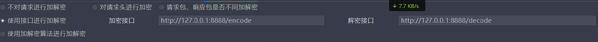
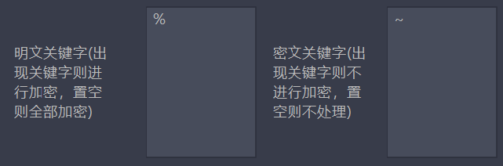

[TOC]

# 使用burp插件autoDecoder实现对smartbi请求包自动加解密

# 安装autoDecoder插件

github下载的在新版burp会有bug，请使用压缩包中的插件安装

# 编写针对smartbi的加解密脚本

因为它的加解密都是一对一替换，所以很简单，就实现加解密两个函数就行了，脚本也在压缩包里。

# 启动加解密脚本

插件里写的是8888端口，怎么改启动端口自己去百度。

# 选择使用接口进行加解密

如图

# 设置监控域名及明密文关键词

smartbi特征比较明显

# 然后就实现自动加解密了

脚本见