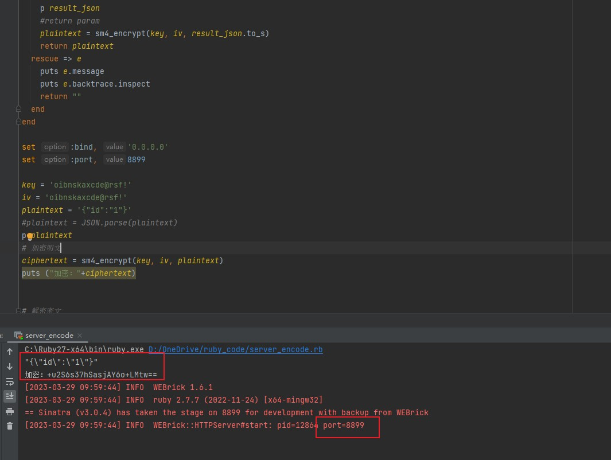
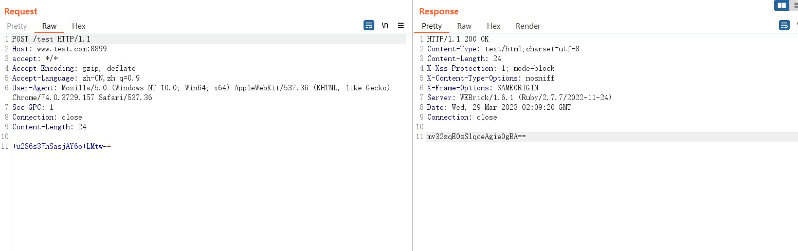
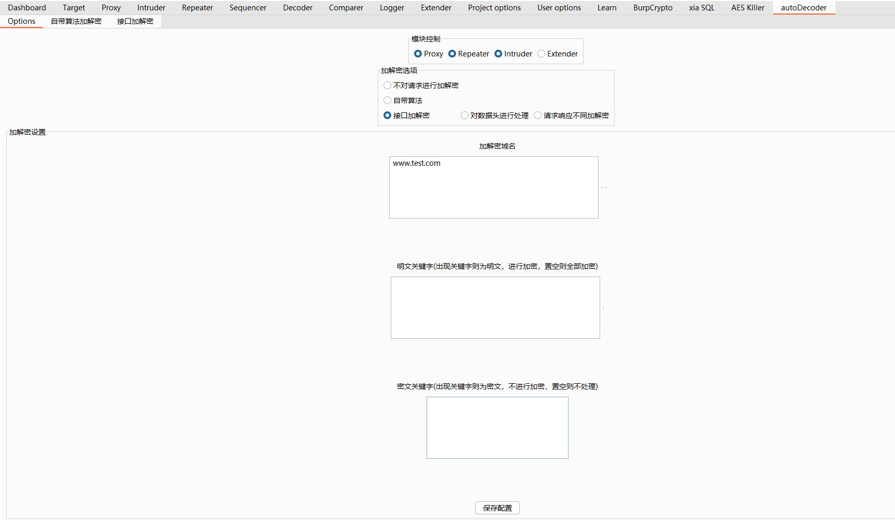
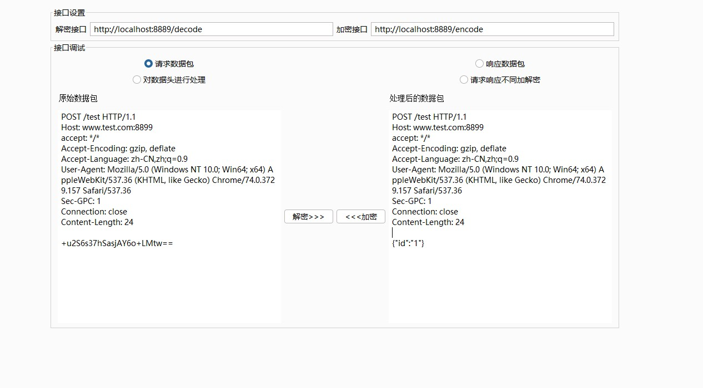
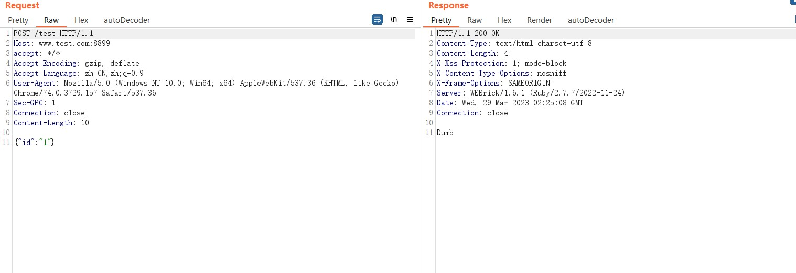
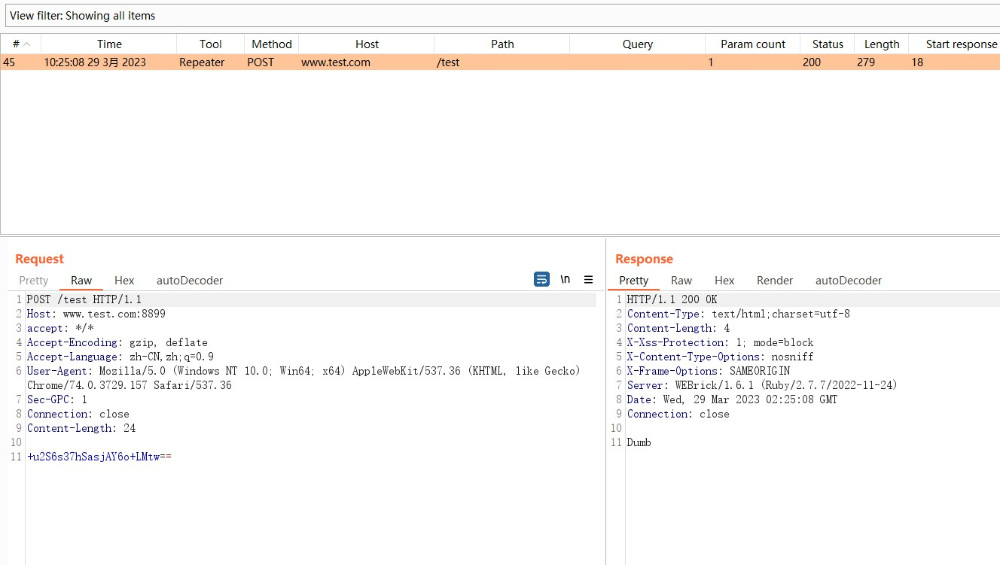
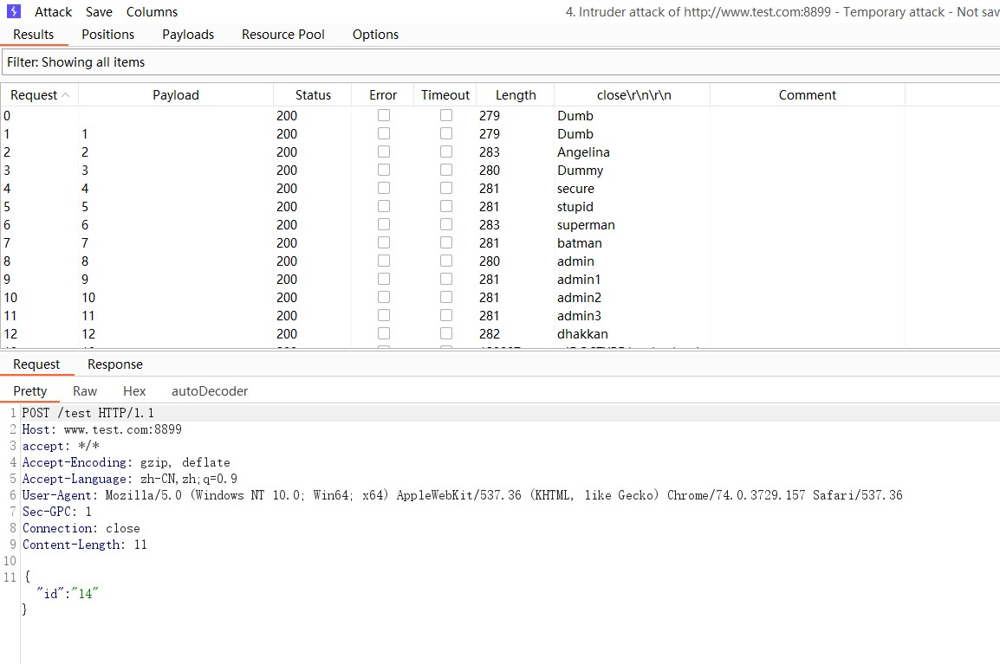

----
created: 2022-09-01T00:06:38+08:00
updated: 2022-09-02T08:42:15+08:00
----
# sm4加解密的例子
## autoDecoder例

遇到一个sm4加密以base64输出的例子，因为工作任务，不方便把站点拿出来，所以写了一个例子。


server.rb是服务端脚本，和作者的testsql.php是一样的作用，不同是接收一段SM4加密后的值。

脚本中数据库连接的数据库可以改成自己的，方便测试。

decode.rb是加解密脚本，包含了数据的加解密功能

监听了本地的8889端口，encode是加密接口，decode是解密接口。

运行服务端脚本，会在本地监听一个8899的端口。




```
加密前：{"id":"1"}
```
```
加密后：+u2S6s37hSasjAY6o+LMtw==
```

### 原始请求包
```
POST /test HTTP/1.1
Host: www.test.com:8899
accept: */*
Accept-Encoding: gzip, deflate
Accept-Language: zh-CN,zh;q=0.9
User-Agent: Mozilla/5.0 (Windows NT 10.0; Win64; x64) AppleWebKit/537.36 (KHTML, like Gecko) Chrome/74.0.3729.157 Safari/537.36
Sec-GPC: 1
Connection: close
Content-Length: 24

+u2S6s37hSasjAY6o+LMtw==
```
### 原始返回包
```
HTTP/1.1 200 OK
Content-Type: text/html;charset=utf-8
Content-Length: 24
X-Xss-Protection: 1; mode=block
X-Content-Type-Options: nosniff
X-Frame-Options: SAMEORIGIN
Server: WEBrick/1.6.1 (Ruby/2.7.7/2022-11-24)
Date: Wed, 29 Mar 2023 02:09:20 GMT
Connection: close

mv32zqE0zSlqceAgieOgBA==
```



使用插件中的自定义接口功能，对请求包和返回包进行加解密，插件配置如下

测试加解密



使用明文进行请求。



在logger中进行查看，已经自动进行了加解密


对ID进行爆破测试。


