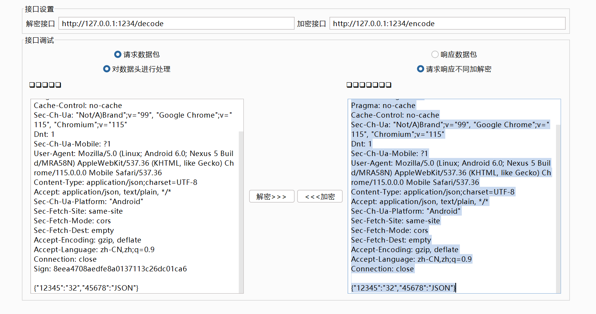
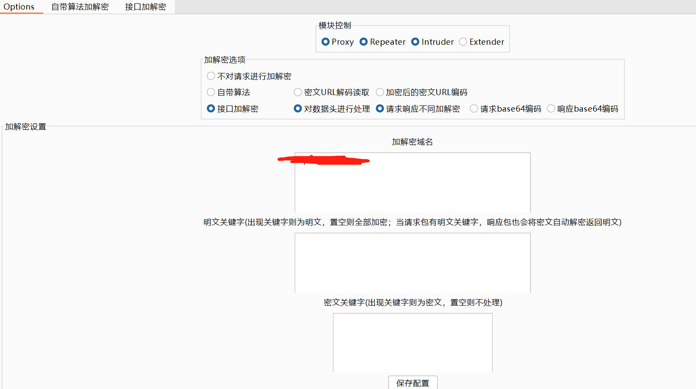
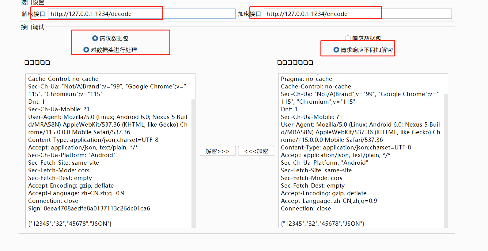
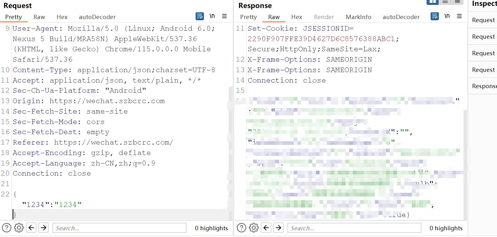
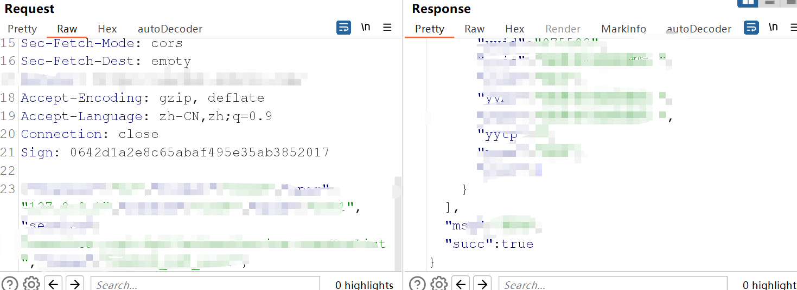

# http请求头sign校验
## autoDecoder例
遇到一个校验http请求头sign的例子。

sign的值生成逻辑是
```
md5(md5('123456') + 'a=123454&123456')
```

PS ：a=123454&123456是请求数据。


### 原始请求包
```
POST /123465 HTTP/1.1
Host: www.baidu.com
Content-Length: 164
Pragma: no-cache
Cache-Control: no-cache
Sec-Ch-Ua: "Not/A)Brand";v="99", "Google Chrome";v="115", "Chromium";v="115"
Dnt: 1
Sec-Ch-Ua-Mobile: ?1
User-Agent: Mozilla/5.0 (Linux; Android 6.0; Nexus 5 Build/MRA58N) AppleWebKit/537.36 (KHTML, like Gecko) Chrome/115.0.0.0 Mobile Safari/537.36
Content-Type: application/json;charset=UTF-8
Accept: application/json, text/plain, */*
Sec-Ch-Ua-Platform: "Android"
Sec-Fetch-Site: same-site
Sec-Fetch-Mode: cors
Sec-Fetch-Dest: empty
Accept-Encoding: gzip, deflate
Accept-Language: zh-CN,zh;q=0.9
Sign: 0642d1a2e8c65abaf495e35ab3852012
Connection: close

{"12345":"32","45678":"JSON"}
```

## 希望达到的效果

输入以下请求包

```
POST /123465 HTTP/1.1
Host: www.baidu.com
Content-Length: 164
Pragma: no-cache
Cache-Control: no-cache
Sec-Ch-Ua: "Not/A)Brand";v="99", "Google Chrome";v="115", "Chromium";v="115"
Dnt: 1
Sec-Ch-Ua-Mobile: ?1
User-Agent: Mozilla/5.0 (Linux; Android 6.0; Nexus 5 Build/MRA58N) AppleWebKit/537.36 (KHTML, like Gecko) Chrome/115.0.0.0 Mobile Safari/537.36
Content-Type: application/json;charset=UTF-8
Accept: application/json, text/plain, */*
Sec-Ch-Ua-Platform: "Android"
Sec-Fetch-Site: same-site
Sec-Fetch-Mode: cors
Sec-Fetch-Dest: empty
Accept-Encoding: gzip, deflate
Accept-Language: zh-CN,zh;q=0.9
Connection: close

{"12345":"32","45678":"JSON"}
```

返回计算好Sign值的数据包
```
POST /123465 HTTP/1.1
Host: www.baidu.com
Content-Length: 164
Pragma: no-cache
Cache-Control: no-cache
Sec-Ch-Ua: "Not/A)Brand";v="99", "Google Chrome";v="115", "Chromium";v="115"
Dnt: 1
Sec-Ch-Ua-Mobile: ?1
User-Agent: Mozilla/5.0 (Linux; Android 6.0; Nexus 5 Build/MRA58N) AppleWebKit/537.36 (KHTML, like Gecko) Chrome/115.0.0.0 Mobile Safari/537.36
Content-Type: application/json;charset=UTF-8
Accept: application/json, text/plain, */*
Sec-Ch-Ua-Platform: "Android"
Sec-Fetch-Site: same-site
Sec-Fetch-Mode: cors
Sec-Fetch-Dest: empty
Accept-Encoding: gzip, deflate
Accept-Language: zh-CN,zh;q=0.9
Connection: close
Sign: 8eea4708aedfe8a0137113c26dc01ca6

{"12345":"32","45678":"JSON"}
```
效果图(左边是计算后的数据包，右边是计算前的数据包)



代码如下，我这边采用的ruby写的，大家可以参考一下。
```
require 'sinatra'
require 'digest'

configure do
  set :bind => '127.0.0.1'
  set :port => '1234'
end

post '/encode' do
  #获取http包中的请求数据
  param = params[:dataBody].strip
  #获取http包中的头信息
  param_headers = params[:dataHeaders].strip
  #计算sign值
  encry_param = Digest::MD5.hexdigest(Digest::MD5.hexdigest('aAr9MVS9j1')+param)
  #获取是请求包还是返回包
  param_requestorresponse = params[:requestorresponse].strip
  #判断是否为请求包，然后进行组装返回
  if param_requestorresponse == "request"
    return param_headers + "\r\n" + "Sign: " + encry_param + "\r\n\r\n\r\n\r\n" + param
  end
end
#因为返回包不需要解密，所以就直接正常返回了
post '/decode' do
  #获取返回包中的请求数据
  param = params[:dataBody].strip
  #获取返回包中的头信息
  param_headers = params[:dataHeaders].strip
  #获取是请求包还是返回包
  param_requestorresponse = params[:requestorresponse].strip
  #判断是否为返回包，然后进行组装返回
  if param_requestorresponse == "response"
    return param_headers + "\r\n\r\n\r\n\r\n" + param
  end
end
```

大家要注意，请求头和数据包之间的换行一定要 "\r\n\r\n\r\n\r\n" ， 

如 headers + "\r\n\r\n\r\n\r\n" + body 。

插件是根据"\r\n\r\n\r\n\r\n"区分的。

运行脚本以后，对插件进行配置。

Options设置图片



接口加解密设置图片




通过autoDecoder插件，请求包中不带sign值，可以正常返回数据包



通过logger查看，已经正常加上了sign值

